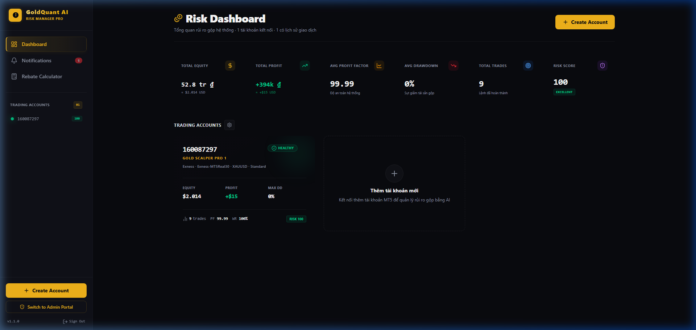
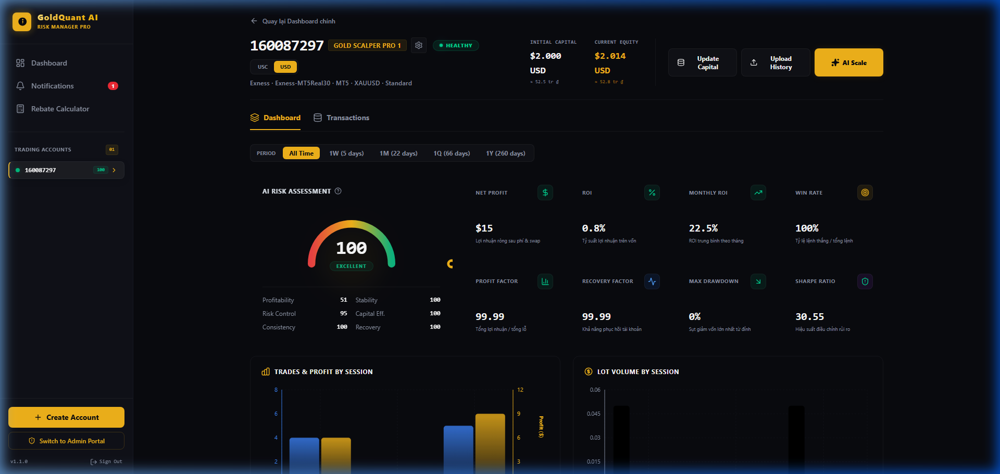
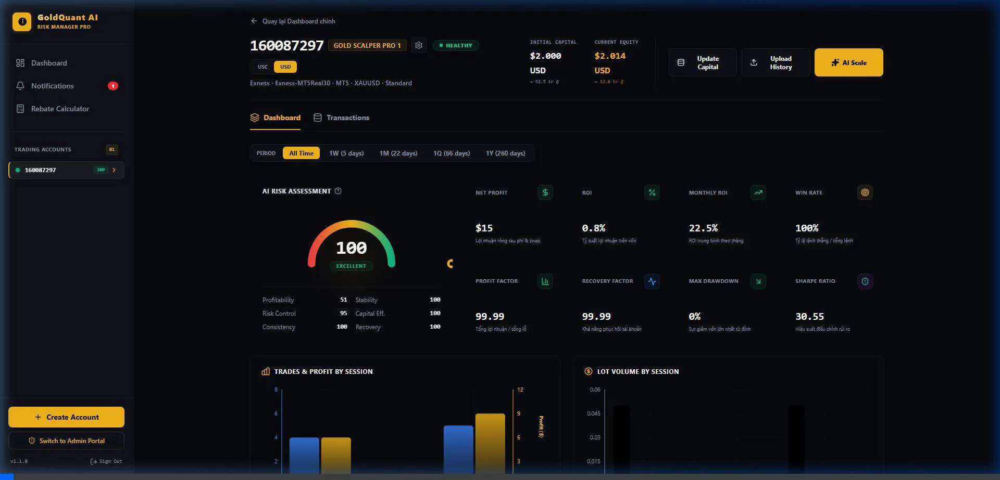

# GoldQuant AI — Dashboard Quản Lý Rủi Ro

**GoldQuant AI** là bảng điều khiển quản lý rủi ro đa tài khoản chuyên nghiệp cho trader **XAUUSD / XAUUSDc** (prop, fund, multi-MT5).

Hệ thống gộp phân tích danh mục, import lịch sử MT5, lịch kinh tế & cảnh báo tin, Telegram, và tư vấn AI — xây dựng bằng **Next.js 16**, **React 19**, **TypeScript**, **Tailwind CSS 4**, **Zustand**, **Firebase Firestore**.

### Liên kết nhanh

| | URL |
|--|-----|
| **Production (Vercel)** | [https://gold-quant-ai.vercel.app](https://gold-quant-ai.vercel.app) |
| **Repository** | [github.com/qtu11/GoldQuant-AI](https://github.com/qtu11/GoldQuant-AI) |
| **Local dev** | [http://localhost:3000](http://localhost:3000) |

---

## Mục lục

1. [Tổng quan](#tổng-quan)
2. [Hình ảnh giao diện](#hình-ảnh-giao-diện)
3. [Tính năng](#tính-năng)
4. [Công nghệ](#công-nghệ)
5. [Kiến trúc](#kiến-trúc)
6. [Cấu trúc dự án](#cấu-trúc-dự-án)
7. [Yêu cầu hệ thống](#yêu-cầu-hệ-thống)
8. [Cài đặt](#cài-đặt)
9. [Biến môi trường](#biến-môi-trường)
10. [Chạy ứng dụng](#chạy-ứng-dụng)
11. [Quy trình sử dụng chính](#quy-trình-sử-dụng-chính)
12. [Logic vốn & equity](#logic-vốn--equity)
13. [Tin tức kinh tế & Telegram](#tin-tức-kinh-tế--telegram)
14. [API routes](#api-routes)
15. [Hướng dẫn xuất báo cáo MT5](#hướng-dẫn-xuất-báo-cáo-mt5)
16. [Design system](#design-system)
17. [Bảo mật](#bảo-mật)
18. [Xử lý sự cố](#xử-lý-sự-cố)
19. [Giấy phép](#giấy-phép)

---

## Tổng quan

| Đối tượng | Mục đích |
|-----------|----------|
| Trader multi-account vàng | Giám sát nhiều TK MT5 theo chủ sở hữu |
| Prop / risk manager | AI Risk Score, drawdown, rule, Telegram breach |
| Vận hành | Báo cáo tuần, cảnh báo tin USD high-impact trước 5 giờ |

**Trụ cột sản phẩm**

- **Rủi ro danh mục** — equity, PnL, PF, WR, max DD, Sharpe, AI Risk 0–100  
- **Mô hình Owner-first** — tạo chủ sở hữu → gắn TK MT5  
- **Import MT5** — CSV / HTML / Excel / TXT → lệnh + nạp/rút → tự cập nhật equity  
- **USC / USD** — tài khoản cent (100 USC = 1 USD), hiển thị kép + VND  
- **Tin tức** — feed Forex Factory theo tuần, cảnh báo ≤5h + LIVE, giờ Mỹ & Việt Nam  
- **AI** — chat advisor, nghiên cứu bot (`.set` + PnL ngày), gợi ý scale vốn  

---

## Hình ảnh giao diện

### Tổng quan rủi ro (Portfolio)

KPI gộp: tổng equity (USD), lợi nhuận, PF, drawdown, số lệnh, VaR / Monte Carlo, nhóm owner, lịch tin.



### Chi tiết tài khoản

AI risk, biểu đồ phiên, equity curve, lịch sử lệnh, nạp/rút, lệnh mở, nghiên cứu bot.



### Demo UI

Glassmorphism / neon (tuân thủ `prefers-reduced-motion` trong design system).



---

## Tính năng

### Đa tài khoản & chủ sở hữu

- Đăng ký **chủ sở hữu**, sau đó tạo **TK MT5** gắn với owner  
- Dashboard theo owner: equity, lãi cộng dồn, PnL hôm nay, risk, lưới thẻ TK  
- Lọc portfolio theo owner và kỳ (`All` / `1W` / `1M` / `1Q`)  

### Phân tích & rủi ro

- **Chỉ số:** net PnL (profit + commission + swap), WR, ROI, monthly ROI, PF, recovery, max DD, Sharpe  
- **AI Risk Score** (0–100, cao = rủi ro cao) kèm sub-metrics: profitability, stability, risk control, capital efficiency, consistency, recovery  
- **Phiên:** Asia / Europe / US (theo giờ mở lệnh)  
- **Equity curve** có tính nạp/rút  
- **Risk rules** (Tools): max DD, risk score, PF, lỗ ngày, equity còn &lt; 50% — Telegram chỉ **critical**  
- **Quant fallback:** VaR 95%, Monte Carlo (engine Node nếu không có quant service ngoài)  

### Import lịch sử MT5

- Định dạng: **CSV, TSV, HTML, Excel (.xlsx/.xls), TXT** (UTF-8 / UTF-16)  
- Parse **Positions** và **Deals** (partial close LIFO, in/out)  
- Parse **Balance / Credit** → capital moves (nạp/rút)  
- Merge thông minh theo fingerprint (không mất lệnh khi upload partial)  
- Sau upload:  

```text
Equity = vốn ban đầu + PnL lệnh đã đóng + nạp − rút
```

### Tiền tệ

- Đơn vị TK: **USD** hoặc **USC** (cent)  
- KPI danh mục luôn quy **USD**  
- Nhãn kép: ví dụ `3,322 USC · ≈ $33.22`  
- Tỷ giá **USD/VND** realtime (nhiều nguồn, có fallback offline)  

### Lịch kinh tế & cảnh báo tin

- Feed full tuần (Forex Factory JSON/CSV + cache disk + seed offline)  
- Hiển thị 2 múi giờ: **🇻🇳 Asia/Ho_Chi_Minh (GMT+7)** và **🇺🇸 US Eastern (EST/EDT)**  
- Tự đổi tuần (`weekKey` = Monday VN) — xóa cache, nạp tuần mới  
- Tin vàng quan trọng: NFP, CPI, PPI, PCE, FOMC, claims, ISM, GDP…  
- Telegram + in-app: **trước ≤ 5 giờ** và cửa sổ **LIVE**  
- Chống spam: 1 lần / sự kiện / phase, rate limit API, dedup nội dung  

### AI

- **AI Advisor** — chat kèm portfolio, giá vàng live, inject calendar  
- Provider: **xAI (Grok)** và/hoặc **Gemini** (`AI_PROVIDER`)  
- **Nghiên cứu bot** (theo từng TK): nạp `.set` EA, series PnL ngày, gợi ý tham số dạng form chỉnh sửa  
- **Daily Brief** / gợi ý capital scaling  

### Tools & tiện ích

- Máy tính lot XAU  
- Theo dõi Prop challenge  
- Rebate calculator  
- So sánh tài khoản, báo cáo tuần HTML  
- Đăng nhập admin (token hash từ login/password)  

---

## Công nghệ

| Lớp | Công nghệ |
|-----|-----------|
| Framework | Next.js **16.2.10** (App Router) |
| UI | React **19.2.4**, TypeScript **5** |
| Style | Tailwind CSS **4**, design neon / glass OLED |
| State | Zustand **5** |
| Lưu trữ | Firebase Firestore + localStorage backup |
| Biểu đồ | Recharts **3.9** |
| Excel | `xlsx` **0.18** |
| Icon | Lucide React |
| Motion | Framer Motion (UI) |

---

## Kiến trúc

```text
┌─────────────────┐     ┌──────────────────┐     ┌─────────────────┐
│  Browser UI     │────▶│  Next.js App     │────▶│  Firestore      │
│  Zustand store  │◀────│  API routes      │     │  accounts/owners│
└────────┬────────┘     └────────┬─────────┘     └─────────────────┘
         │                       │
         │              ┌────────┴─────────┐
         │              │ Bên ngoài        │
         │              │ • Forex Factory  │
         │              │ • API giá vàng   │
         │              │ • xAI / Gemini   │
         │              │ • Telegram Bot   │
         │              └──────────────────┘
         │
         ▼
   localStorage + .data/* (cache calendar, rate Telegram phía server)
```

- **Client:** pages `src/app/*`, components, Zustand  
- **Server:** `src/app/api/**` — auth, Telegram, calendar, AI, giá vàng, news-alerts  
- **Domain:** `src/utils/*` (analytics, parser, equity, tin tức…)  

---

## Cấu trúc dự án

```text
Dashbboard-Gold/
├── .env.example              # Mẫu biến môi trường
├── design-system/MASTER.md   # Token UI (cyberpunk neon / OLED)
├── docs/                     # Nghiên cứu & tài liệu
├── public/                   # Brand tĩnh
├── src/
│   ├── app/
│   │   ├── page.tsx          # Tổng quan portfolio + chi tiết TK
│   │   ├── owners/           # Chủ sở hữu & PnL theo owner
│   │   ├── news/             # Lịch kinh tế + panel cảnh báo
│   │   ├── notifications/    # Chuông in-app (risk + tin)
│   │   ├── tools/            # Lot, prop, risk rules
│   │   ├── rebate/           # Tính rebate
│   │   ├── admin/            # Giao diện admin
│   │   └── api/
│   │       ├── auth/         # Login / verify token
│   │       ├── telegram/     # Gửi tin (có rate-limit)
│   │       └── quant/
│   │           ├── ai-advisor/
│   │           ├── bot-research/
│   │           ├── calendar/
│   │           ├── gold-price/
│   │           └── news-alerts/
│   ├── components/           # UI (card, chart, panel, modal)
│   ├── store/
│   │   ├── useTradingStore.ts
│   │   ├── useAuthStore.ts
│   │   └── useToolsStore.ts
│   ├── utils/                # Domain logic
│   └── data/                 # calendar-seed.json
├── package.json
└── README.md
```

---

## Yêu cầu hệ thống

- **Node.js** ≥ 18 (khuyến nghị 20 LTS)  
- **npm** / yarn / pnpm  
- Dự án Firebase (Firestore) để đồng bộ cloud  
- Tuỳ chọn: Telegram bot, API key xAI và/hoặc Gemini  

---

## Cài đặt

```bash
# Clone
git clone <url-repo> Dashbboard-Gold
cd Dashbboard-Gold

# Cài dependency
npm install

# Cấu hình môi trường
cp .env.example .env
# Chỉnh .env: Firebase, Telegram, AI (xem bên dưới)
```

---

## Biến môi trường

Sao chép từ `.env.example`:

### Đăng nhập admin

| Biến | Mô tả |
|------|--------|
| `ADMIN_LOGIN` | Tên đăng nhập dashboard |
| `ADMIN_PASSWORD` | Mật khẩu dashboard |

### Firebase (client)

| Biến | Mô tả |
|------|--------|
| `NEXT_PUBLIC_FIREBASE_API_KEY` | Web API key |
| `NEXT_PUBLIC_FIREBASE_AUTH_DOMAIN` | Auth domain |
| `NEXT_PUBLIC_FIREBASE_PROJECT_ID` | Project ID |
| `NEXT_PUBLIC_FIREBASE_STORAGE_BUCKET` | Storage bucket |
| `NEXT_PUBLIC_FIREBASE_MESSAGING_SENDER_ID` | Messaging sender |
| `NEXT_PUBLIC_FIREBASE_APP_ID` | App ID |
| `NEXT_PUBLIC_FIREBASE_MEASUREMENT_ID` | Analytics (tuỳ chọn) |

Collection Firestore: **`accounts`**, **`owners`**.  
Cần cấu hình security rules phù hợp production.

### Telegram

| Biến | Mô tả |
|------|--------|
| `TELEGRAM_BOT_TOKEN` | Token từ BotFather |
| `TELEGRAM_CHAT_ID` | ID chat / kênh nhận tin |

### AI (nên có ít nhất 1 key)

| Biến | Mô tả |
|------|--------|
| `XAI_API_KEY` | API key xAI / Grok |
| `XAI_MODEL` | Ghi đè model (tuỳ chọn) |
| `GEMINI_API_KEY` | Key Google AI Studio |
| `AI_PROVIDER` | `xai` \| `gemini` (ưu tiên xAI nếu có key) |

### Dữ liệu thị trường (tuỳ chọn)

| Biến | Mô tả |
|------|--------|
| `GOLDAPI_IO_KEY` | Provider giá vàng |
| `METALPRICE_API_KEY` | API kim loại thay thế |

---

## Chạy ứng dụng

### Production (đã deploy)

- **Live app:** [https://gold-quant-ai.vercel.app](https://gold-quant-ai.vercel.app)  
- Deploy trên **Vercel** — cấu hình biến môi trường (Firebase, Telegram, AI…) trong **Project Settings → Environment Variables**, rồi redeploy.

### Local

```bash
# Development (Turbopack)
npm run dev
# → http://localhost:3000

# Production build local
npm run build
npm start

# Lint
npm run lint
```

Đăng nhập bằng `ADMIN_LOGIN` / `ADMIN_PASSWORD` (trùng env trên Vercel nếu đã set).

---

## Quy trình sử dụng chính

### 1. Chủ sở hữu → TK MT5

1. Vào **Owners** → tạo chủ sở hữu  
2. **Thêm TK MT5** — ID, broker, server, symbol, loại TK, tiền tệ (USD/USC), vốn ban đầu, đòn bẩy  
3. TK Cent: **100 USC = 1 USD** (ví dụ 2.000 USC = **$20**)  

### 2. Import lịch sử

1. Xuất MT5 **History → Report** (ưu tiên HTML hoặc Excel)  
2. Chi tiết TK → **Upload History**  
3. Hệ thống merge lệnh + dòng Balance/Credit  
4. Equity & stats tự tính lại  

### 3. Vốn & lệnh mở

- **Update Capital** — đồng bộ equity (qua capital moves)  
- Tab **Capital** — nạp/rút thủ công  
- **Open Positions** — floating PnL thủ công (mô hình XAU)  

### 4. Nghiên cứu bot (theo TK)

1. Tab **Nghiên cứu bot**  
2. Nạp file `.set` EA + (tuỳ chọn) series lãi ngày  
3. **AI phân tích** → risk + gợi ý tham số dạng form  
4. **Áp dụng gợi ý** → **Xuất .set** nạp lại MT5  

### 5. Tin tức & cảnh báo

1. Trang **News** hoặc panel calendar trang chủ  
2. Khi đã login, background poll news-alerts  
3. Telegram + Notifications cho tin high-impact vàng (≤5h + LIVE)  

---

## Logic vốn & equity

```text
Equity đóng = vốn ban đầu
            + Σ (profit + commission + swap) các lệnh đã đóng
            + Σ nạp − Σ rút
```

| Khái niệm | Ghi chú |
|-----------|---------|
| **USC** | Đơn vị cent; KPI gộp vẫn quy USD |
| **Merge upload** | Ticket + fingerprint close; giữ partial close |
| **Kỳ 1W/1M** | Cửa sổ theo đồng hồ lịch (chung multi-TK); demo fallback nếu history cũ |
| **PnL hôm nay** | Ngày từ chuỗi closeTime; “hôm nay” theo Asia/Ho_Chi_Minh |

**Ví dụ cent:** 8 TK × 2.000 USC = 16.000 USC = **$160** vốn.  
Cộng lãi → equity gộp **~$280** là **đúng** — không phải $16.000.

---

## Tin tức kinh tế & Telegram

| Cơ chế | Hành vi |
|--------|---------|
| Nguồn | Forex Factory tuần (JSON/CSV) + cache + seed offline |
| Week key | Monday (VN) `YYYY-MM-DD`; tuần mới → xóa cache |
| Giờ | Absolute UTC; UI: VN + US Eastern |
| Pre-alert | Còn ≤ 5h và > 30 phút (1 lần / sự kiện) |
| LIVE | −15 phút … +25 phút quanh giờ công bố |
| Chống spam | Mark đã gửi kể cả fail; API ≥40s; dedup 10 phút; risk TG chỉ critical 1×/ngày/rule |

**Cron tuỳ chọn** (khi không mở trình duyệt):

```bash
# Local
curl -X POST http://localhost:3000/api/quant/news-alerts

# Production (Vercel)
curl -X POST https://gold-quant-ai.vercel.app/api/quant/news-alerts
```

File cache server trong `.data/` (thường gitignore): calendar, dedup news-alerts, rate Telegram.

---

## API routes

| Method | Path | Mục đích |
|--------|------|----------|
| `POST` | `/api/auth` | `login` / `verify` |
| `POST` | `/api/telegram` | Gửi tin HTML (rate-limit) |
| `GET` | `/api/quant/calendar` | Lịch full tuần (`force=1`, filter) |
| `GET/POST` | `/api/quant/news-alerts` | Kiểm tra/gửi cảnh báo tin (`dry=1` xem trước) |
| `GET` | `/api/quant/gold-price` | Giá XAU live |
| `POST` | `/api/quant/ai-advisor` | Chat AI advisor |
| `POST` | `/api/quant/bot-research` | Gợi ý tham số bot có cấu trúc |

---

## Hướng dẫn xuất báo cáo MT5

1. Mở **MetaTrader 5**  
2. **Toolbox → History**  
3. Chuột phải → **Report** → **HTML** hoặc **Open XML (Excel)**  
4. Nên xuất **đủ kỳ** (bảng Positions là tốt nhất)  
5. Kéo thả vào **Upload History** trên GoldQuant  

**Lưu ý**

- Bảng Positions: đủ open/close time & giá  
- Bảng Deals: ghép LIFO + Balance/Credit → nạp/rút  
- Upload lại: merge, không xóa ticket khác  

---

## Design system

- Nguồn chuẩn: `design-system/MASTER.md`  
- Phong cách: **Cyberpunk Neon + OLED Dark**, density dashboard  
- Skills UI/UX: `.agents/skills/`  
- Tôn trọng **`prefers-reduced-motion`**  

---

## Bảo mật

- Đổi mật khẩu admin mặc định trên production  
- Không commit file `.env`  
- Siết Firestore rules (chỉ write hợp lệ)  
- Route Telegram không auth — bảo vệ bằng mạng / reverse proxy khi public  
- Key AI và giá vàng chỉ server-side (không prefix `NEXT_PUBLIC_`)  

---

## Xử lý sự cố

| Vấn đề | Kiểm tra |
|--------|----------|
| Login fail | `ADMIN_LOGIN` / `ADMIN_PASSWORD`; restart sau khi sửa `.env` |
| Không thấy TK | Firebase config + rules; console / fallback localStorage |
| Equity “quá nhỏ” (cent) | 100 USC = $1; 2.000 USC = $20 — đối chiếu đơn vị MT5 |
| Upload 0 lệnh | Report History đầy đủ; sheet Positions; không chỉ open orders |
| Spam Telegram (bản cũ) | Restart server; file `.data/*`; dùng bản anti-spam mới |
| Calendar cũ | Refresh / `force=1`; rollover Monday; FF 429 → đợi hoặc seed |
| AI trống / 429 | Cấu hình `XAI_API_KEY` và/hoặc `GEMINI_API_KEY`; fallback rule engine |

---

## Scripts

```bash
npm run dev      # Chạy local
npm run build    # Build production
npm start        # Serve production
npm run lint     # ESLint
```

---

## Giấy phép

Dự án private / độc quyền trừ khi chủ repo quy định khác.  
**Không phải lời khuyên đầu tư.** Giao dịch XAU có rủi ro mất vốn.

---

## Ghi nhận

- **Sản phẩm:** GoldQuant AI Risk Manager  
- **Stack:** Next.js · React · Tailwind · Zustand · Firebase · Recharts  
- **Lịch tin:** feed công khai Forex Factory (bên thứ ba, có thể rate-limit)  
- **Design:** OLED neon / liquid glass dashboard  

---

**GoldQuant AI** — rủi ro multi-account XAU, import MT5, tin tức và AI trong một dashboard.

**Live:** [https://gold-quant-ai.vercel.app](https://gold-quant-ai.vercel.app)
